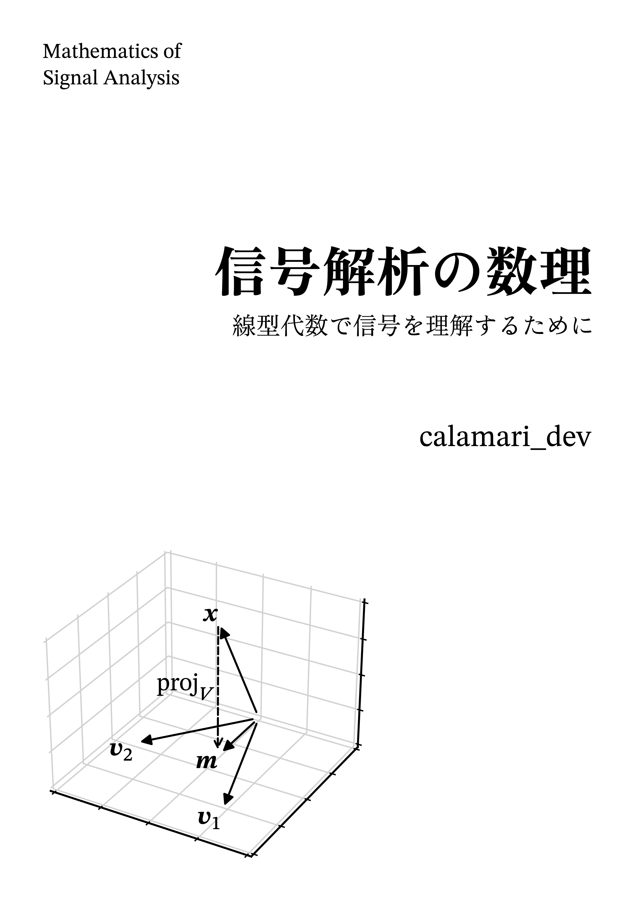

# 信号解析の数理



## 注意

この本は書きかけであり，内容の正しさについては一切保証できません．

## PDFのダウンロード方法

アルファ版・ベータ版・正式版の3種類に分けて配布する予定です．各版の違いは以下の通りです．

+ アルファ版はバージョン番号なし，大きな透かしあり
+ ベータ版はバージョン番号`0.y.z`，小さな透かしあり
+ 正式版はバージョン番号`1.y.z`，透かしなし

現在は，アルファ版を`src/main.pdf`で公開しています．内容がある程度まとまり次第，ベータ版を<https://github.com/calamari-dev/sigproc/releases>で配布する予定です．なお，各ブランチにあるLaTeXソースは下書きやメモを含むため，誤りを含む可能性が多分にあります．そのため，内容に関するご指摘は最新のリリースに対してお願い致します．

## ライセンス

+ `src/`以下のファイルは[CC BY-NC-SA 4.0](https://creativecommons.org/licenses/by-nc-sa/4.0/deed.ja)の下で配布しています[^1]
+ `fonts/`以下のファイルは各フォントのライセンスの下で再配布しています

[^1]: [コミットe063f2e](https://github.com/calamari-dev/sigproc/commit/e063f2e6e5169269f6557282730d2f6154ede8de)以前は，`src/`以下のファイルを[CC BY 4.0](https://creativecommons.org/licenses/by/4.0/deed.ja)の下で配布していました．

## ビルド方法

```
$ docker compose build
$ docker compose run --rm sigproc
$ pipenv sync --dev # 初回のみ
$ pipenv run publish
```
